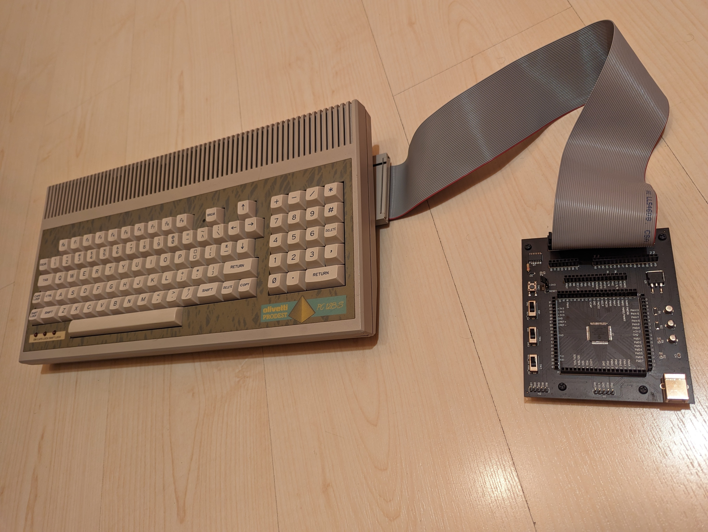
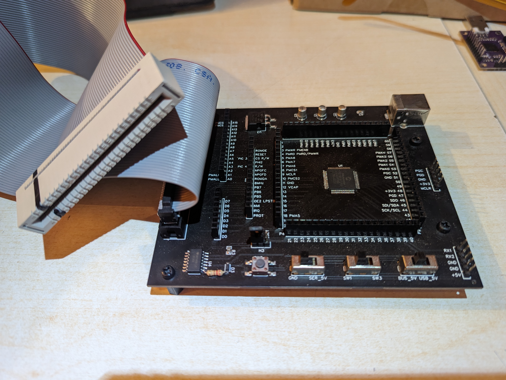

# Acorn BBC Master Compact expansion cartridge firmware project

This is the repository containing the firmware for the [acorn_bbc_master_compact_expansion_board](https://oshwlab.com/black__man/acorn_bbc_master_compact_expansion_board) open source hardware project in [OSHWLab](https://oshwlab.com/).
 
At the current development stage the firmware is only capable of printing stuff through the serial port and nothing else. When I will have some spare time from work I will start working on the firmware and correct any mistakes in the PCB

## Some pictures of the board

